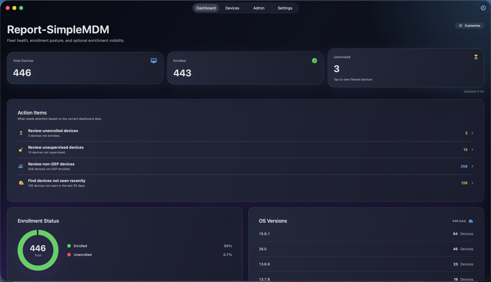
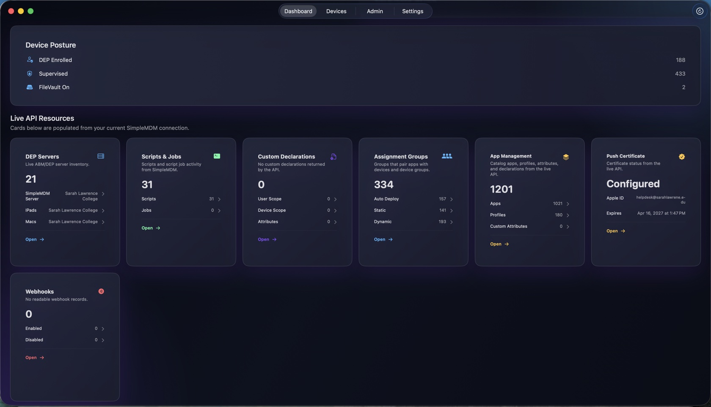
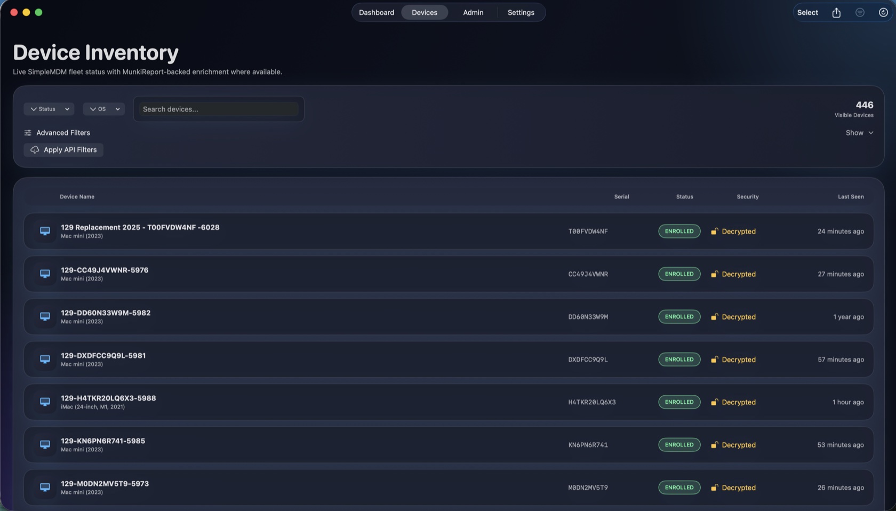
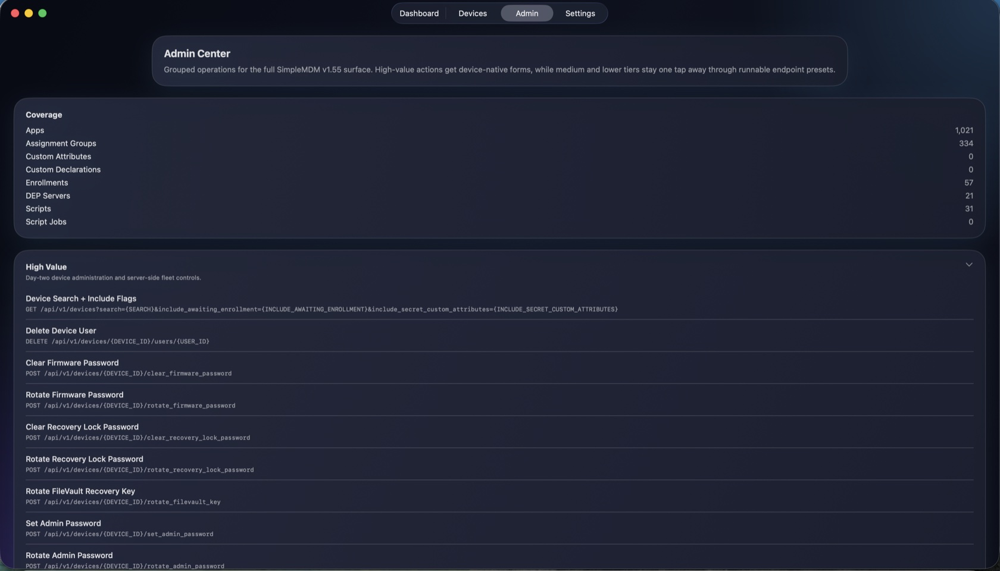
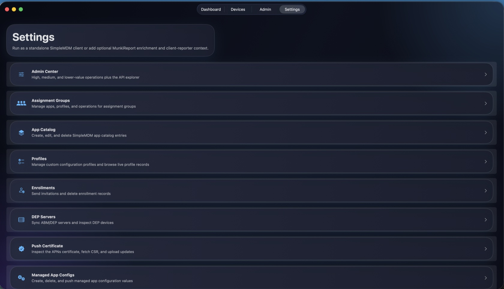

# ReportSimpleMDM

ReportSimpleMDM is a native SwiftUI client for SimpleMDM that runs on macOS, iOS, iPadOS, and visionOS. It gives admins a fast, operator-focused view of fleet state while exposing the full SimpleMDM API surface through native workflows, bulk operations, an API catalog, and runnable endpoint presets.

The app is designed first as a standalone SimpleMDM operations client. Optional MunkiReport enrichment is supported but additive rather than foundational.

# Contact me if you want to be added to the app testing group. 
-- For iOS and Android

---
## 🌐 Connect With Me
- [GitHub](https://github.com/hov172)  
- [PowerShell Gallery](https://www.powershellgallery.com/profiles/hov172)  
- 📨 Slack: **@Hov172**  
- 🕹️ Discord: **Jay172_**  
- [LinkedIn](https://www.linkedin.com/in/jesus-a-785bb616?trk=people-guest_people_search-card)  
- 🐦 [Twitter / X (@AyalaSolutions)](https://twitter.com/AyalaSolutions)  
- <a href="https://bsky.app/profile/ayalasolutions.bsky.social"></a> [@AyalaSolutions](https://bsky.app/profile/ayalasolutions.bsky.social)  
- [](https://buymeacoffee.com/hov172)  
- 📧 *Contact via GitHub, Social accounts issues or discussions*  

## Screenshots

### Dashboard — KPI & Action Items


### Dashboard — Device Posture & Resources


### Device Inventory


### Admin Center


### Settings


## Table Of Contents

- [What The App Can Do Today](#what-the-app-can-do-today)
- [Architecture](#architecture)
- [Platform Support](#platform-support)
- [Detailed Capability Breakdown](#detailed-capability-breakdown)
- [Settings, Diagnostics, And Operator Controls](#settings-diagnostics-and-operator-controls)
- [API Permission Model](#api-permission-model)
- [Performance Characteristics](#performance-characteristics)
- [How Data Flows Through The App](#how-data-flows-through-the-app)
- [Startup, Sync, Cache, And Snapshot Lifecycle](#startup-sync-cache-and-snapshot-lifecycle)
- [MunkiReport SimpleMDM Module](#munkireport-simplemdm-module)
- [Quickstart](#quickstart)
- [Deployment Examples](#deployment-examples)
- [Feature To Data Source Mapping](#feature-to-data-source-mapping)
- [Capability Matrix](#capability-matrix)
- [Permission Matrix](#permission-matrix)
- [Endpoint Appendix](#endpoint-appendix)
- [Failure Modes And Fallback Behavior](#failure-modes-and-fallback-behavior)
- [Known Limitations](#known-limitations)
- [Known Bugs](#known-bugs)
- [Security And Secrets](#security-and-secrets)
- [Architecture Diagram](#architecture-diagram)
- [Troubleshooting Recipes](#troubleshooting-recipes)
- [Glossary](#glossary)
- [Changelog And Release History](#changelog-and-release-history)
- [Validation Checklist](#validation-checklist)
- [Important Operational Details](#important-operational-details)
- [Security And Storage](#security-and-storage)
- [Current Boundaries And Caveats](#current-boundaries-and-caveats)
- [Bottom Line](#bottom-line)
- [Connect With Me](#connect-with-me)

## What The App Can Do Today

At a practical level, the product currently supports all of the following:

- connect directly to SimpleMDM with a saved API key
- save and switch between multiple SimpleMDM accounts without re-entering credentials
- browse and filter the live device fleet
- bulk-select devices and execute lock, sync, or push-apps across all selected at once
- export the current device list to CSV via the native share sheet
- cache fleet data locally for fast relaunches
- inspect enrolled and non-enrolled devices
- load device subresources including profiles, apps, users, and logs
- view and inline-edit custom attribute values per device
- run scripts on a specific device and receive a local notification when the job completes
- execute common and advanced device actions
- view the push certificate expiry date and see a prominent warning banner when it is within 30 days
- review dashboard Action Items and customize which triage signals are shown
- show a DEP server token status card on the dashboard with valid / expiring soon / expired / missing buckets, plus a conditional token-expiry action item and DEP server detail expiry fields
- create and manage assignment groups, including viewing filter criteria for dynamic groups
- set custom attribute values on assignment groups
- create and manage app catalog entries, including viewing and deleting Munki pkginfo
- create and manage custom configuration profiles
- create and manage custom declarations
- create, edit, and delete custom attribute definitions
- create, edit, and delete webhooks
- browse account-level MDM logs with search and CSV export
- manage enrollments, DEP servers, push certificates, managed app configs, scripts, and script jobs
- view account details including name, email, push certificate status, and ABM connection state
- edit account settings
- browse a built-in SimpleMDM API catalog with copy-as-curl support
- tune cache freshness, inspect sync history, and review sync diagnostics

This is not just a dashboard demo. The app contains real management surfaces, write flows, confirmation UX, permission-aware behavior, local persistence, and a wide range of operational tooling covering the full SimpleMDM API v1.55 surface.

## Architecture

### Source Of Truth

The app works in two modes:

- `SimpleMDM API Only`
  - direct read and write access to SimpleMDM
  - no MunkiReport dependency
- `SimpleMDM + MunkiReport Module`
  - SimpleMDM remains the system of record for devices and actions
  - optional MunkiReport module data can enrich dashboards and device detail with supplemental context

SimpleMDM is the source of truth for:

- device inventory
- device detail and subresources
- device actions
- resource management
- catalog operations
- write mutations

MunkiReport support is additive. When configured, the app can read module-backed data to enrich:

- dashboard widgets
- connected-resource summaries
- supplemental fleet context
- source detection and enrichment-health visibility

If MunkiReport is not configured, the app still functions as a standalone SimpleMDM client.

### App Structure

The top-level app experience is organized into four main tabs:

- `Dashboard`
- `Devices`
- `Admin`
- `Settings`

On first launch, the app shows a setup flow that writes the SimpleMDM API key to the keychain and saves connection metadata in user defaults. Once configured, the main tab UI is unlocked.

### Connecting To The Optional MunkiReport Module

If you use the MunkiReport `simplemdm` module, the setup, connection, examples, and usage notes are grouped later in [MunkiReport SimpleMDM Module](#munkireport-simplemdm-module).

### Persistence And Startup Strategy

The app is designed to be usable on larger fleets and slower networks. It uses:

- SwiftData-backed persistence for cached devices, launch snapshots, resource records, smart groups, and sync history
- keychain storage for SimpleMDM and optional MunkiReport secrets, including per-account keys for multi-account support
- cache-first startup so a recent fleet snapshot can appear before a live refresh finishes
- incremental page persistence during device pagination
- deferred loading of secondary dashboard resources after the initial device snapshot appears
- sync summaries that track request counts, request category, duration, and errors

The current persistence model includes cached fleet data, launch snapshots, resource records, smart-group data, and sync history.

## Platform Support

The project is a shared SwiftUI app for Apple platforms.

Current platform-specific behavior includes:

- iOS background refresh scheduling on physical devices
- iOS local push notifications for script job completion
- compact iPhone layouts for dashboard and inventory screens
- macOS split-view device detail with a dedicated actions sidebar
- visionOS shares the same SwiftUI experience, with iOS-only behaviors compiled out where the platform does not support them
- a common shared service layer and most shared management workflows across the supported platforms

## Detailed Capability Breakdown

### 1. Dashboard

The dashboard is a substantial operational screen. It currently supports:

- total device KPI
- enrolled vs unenrolled KPI
- enrollment status widget
- OS version breakdown
- recently seen devices
- device posture summary
  - DEP-enrolled
  - supervised
  - FileVault enabled
- push certificate expiry banner
  - warning state when fewer than 30 days remain
  - critical state when fewer than 7 days remain
- Action Items panel
  - enabled by default
  - works with either the original dashboard layout or Compact Dashboard Layout
  - each Action Item type can be enabled or disabled individually
  - items are grouped by SimpleMDM API, MunkiReport module, MunkiReport supplemental, and cache source
- auto-hide control for the `Unenrolled` KPI when the count is zero
- live direct-resource cards
  - DEP servers
  - scripts
  - script jobs
  - assignment groups
  - apps
  - custom declarations
  - webhooks
  - push certificate

When optional module data is available, the dashboard adds a labeled **MunkiReport Insights** section (a header with a MODULE tag and the configured server host) grouping the four module-only widgets:

- sync health
- compliance
- supplemental overview
- AppleCare coverage

The section renders only while module data is actually loading successfully — in API-only mode (or when the module connection is down) it disappears entirely, so the dashboard looks complete in every backend mode.

Dual-source widgets stay in the main grid and switch data sources transparently: OS version breakdown, assignment group distribution, and resource type distribution show a small "via MunkiReport" caption when module data is feeding them, and fall back to direct SimpleMDM API data otherwise.

Interactive navigation is wired into dashboard content. Examples:

- selecting `Unenrolled` jumps into a filtered device list
- selecting a specific OS version opens devices filtered to that version
- posture panels drive inventory filtering
- live resource cards open resource-specific list or management screens

Startup behavior is optimized for faster first paint:

- a cached device snapshot may render first
- the first page of live devices can publish quickly
- remaining pages continue in the background
- lower-priority dashboard resources are deferred until after the initial fleet view appears

The dashboard also exposes operational health:

- refresh banners
- sync health
- freshness state
- collapsible or lower-priority diagnostic surfaces so primary fleet information stays prominent

### 2. Device Inventory

The device list supports both local filtering and live server-side querying.

Supported search and filtering behavior includes:

- server-side SimpleMDM search
  - name
  - serial
  - UDID
  - IMEI
  - MAC address
  - phone number
- status filtering
- OS-family filtering
- exact OS version filtering
- posture filtering
  - DEP enrolled
  - supervised
  - FileVault enabled
- model family filtering
- passcode compliance filtering
- assignment group filtering
- device group filtering
- last-seen recency filtering
- `include awaiting enrollment`
- `include secret custom attributes`

The device list also supports local smart groups backed by SwiftData, so operators can save and reapply local filter bundles without going back to the server.

#### Bulk Actions

The device list has a selection mode. When active:

- tap any device row to toggle it into the selection set
- a bottom action bar appears showing the count of selected devices
- available bulk actions: Lock, Sync, Push Apps, Disable Activation Lock, and Send Message (Send Message opens a sheet to compose one message for all selected devices)
- the bulk action bar scrolls horizontally so actions never overflow on narrow screens
- all selected devices receive the action concurrently via a task group
- exiting selection mode or completing an action clears the selection

#### CSV Export

A share-sheet button in the toolbar exports the current filtered device list to CSV. The export includes:

- Name
- Serial
- Status
- Model
- OS Version
- Last Seen
- Supervised
- DEP
- FileVault
- IP Address

### 3. Device Detail

Device detail is one of the deepest parts of the app.

Current device detail behavior includes:

- a dedicated overview experience
- an inventory view
- a custom attributes tab
- a script jobs tab
- device actions
- automatic live detail loading for enrolled devices
- graceful handling for non-enrolled devices

The overview and inventory flows expose:

- battery data
- storage data
- hardware identity
- security posture
- connected resources
- assignment group and device group context
- synced subresource summaries
- full inventory fields

#### Custom Attributes Tab

The custom attributes tab shows all attribute definitions from the account. For each attribute:

- the current value for this device is shown
- an inline text field allows editing the value
- a Save button writes the new value to the API immediately
- save state per attribute is tracked independently so multiple can be edited at once

#### Script Jobs Tab

The script jobs tab shows recent script jobs associated with this device and allows running new ones.

- all script jobs linked to this device are listed with status badges and timestamps
- status badge colors: mint for completed, amber for pending, red for failed
- a script picker shows all scripts in the account
- Run button creates a new script job scoped to this device
- the service layer fires a local push notification when the job reaches a terminal status

### 4. Device Subresources

The app loads and displays multiple per-device subresources:

- profiles
- installed apps
- users
- logs

Subresource UI includes:

- expand/collapse behavior
- summary counts
- section-based navigation from summary rows
- device log fetches using device-specific lookup
- log-detail fetches for individual log records

When MunkiReport enrichment is configured, device detail can also show connected-resource summaries for supplemental module-backed context.

### 5. Installed Apps

Installed apps are implemented as a real workflow, not a raw JSON dump.

Current installed-app features include:

- per-device installed-app lists
- installed-app detail screens
- grouping by management and catalog state
  - managed and in catalog
  - managed and not in catalog
  - unmanaged and in catalog
  - unmanaged and not in catalog
- catalog matching against live SimpleMDM app records
- assignment-group-derived app context
- managed-app-config signal visibility

Supported installed-app actions include:

- request management
- update
- uninstall

The service layer keeps a cached per-device installed-app inventory state so the UI does not have to recompute joins and derived state on every render.

### 6. Device Actions

The app supports a wide range of device actions.

Current action coverage includes:

- lock
- wipe — including the additional parameters Preserve cellular data plan, Release Activation Lock, Disallow Proximity Setup, Return to Service (with WiFi profile picker), **Preserve Managed Apps** (iOS 26+/visionOS 26+, with Return to Service), and Obliteration behavior (macOS)
- sync or refresh
- clear passcode
- restart
- shutdown
- push apps
- clear restrictions password
- **send message** — composes and sends a message to the device (supervised iOS/iPadOS); also available as a bulk action
- **disable activation lock** — releases Activation Lock so the device can be set up by a new user (enrolled + supervised devices that currently have Activation Lock on); also available as a bulk action
- **refresh cellular plans** — refreshes eSIM/cellular plans using the carrier's eSIM server URL (enrolled, cellular-capable iOS devices)
- unenroll

Each action is gated by an availability rule and shows a disabled state with the reason when the current device does not qualify (for example, not enrolled, not supervised, Activation Lock not enabled, or no cellular capability). The device detail inventory also surfaces an **Activation Lock** status row (Enabled / Disabled / Unknown).

Lost Mode support includes:

- enable
- disable
- play sound
- update location

Advanced action coverage includes:

- clear firmware password
- rotate firmware password
- clear recovery lock password
- rotate recovery lock password
- rotate FileVault recovery key
- set admin password
- rotate admin password
- update OS
- enable remote desktop
- disable remote desktop
- disable bluetooth
- set time zone

Safeguards in the UI include:

- explicit confirmation for destructive actions
- lock-specific payload handling
- wipe-specific confirmation flow
- lost-mode form validation
- separation of mutation errors from detail-loading errors

Action availability is permission-aware and state-aware. The app disables actions after observed permission failures and presents the missing permission domain in a user-facing way.

### 7. Device Editing And Assignment

Native device management includes:

- edit the SimpleMDM record name
- edit device-facing name where supported
- create device placeholders
- assign a device to assignment groups
- remove a device from assignment groups
- optionally remove other group assignments when moving a device

On macOS, device management is especially strong because the detail view keeps actions in a dedicated sidebar.

### 8. Assignment Groups

Assignment groups are a first-class management area.

Current assignment-group workflows include:

- list and search groups
- create groups
- edit groups
- delete groups
- inspect group metadata
- inspect membership summaries
- assign and unassign apps
- assign and unassign profiles
- assign and unassign devices
- push apps
- update apps
- sync profiles
- clone groups

The group list row displays a Static or Dynamic capsule badge for each group so type is visible at a glance without opening the detail screen.

#### Dynamic Groups

When a group has `group_type: dynamic`, the detail screen shows a read-only Filter Criteria section:

- Attribute — the device field used for matching
- Operator — the comparison operator
- Value — the match target
- Matched Devices — the current member count

Dynamic group membership is computed by SimpleMDM and cannot be edited directly.

#### Custom Attributes On Groups

The group detail screen includes a Custom Attributes section listing all attribute definitions in the account. Each row shows a text field for the value and a Save button that writes the value to `POST /assignment_groups/{id}/custom_attributes/{key}`.

The group detail screen also tracks local assignment state for:

- assigned app IDs
- assigned profile IDs
- assigned device IDs

This gives the UI fast feedback while still writing back through the shared service layer.

### 9. Apps And App Catalog

The app catalog is managed natively.

Current app-catalog coverage includes:

- list and search app records
- create App Store catalog entries
- edit catalog entries
- delete app records
- inspect app detail
- inspect device installs for a catalog app
- jump from a catalog app into assignment-group management
- jump from a catalog app into managed-app-config workflows
- view and delete Munki pkginfo XML for a catalog app

#### Munki Pkginfo

Each app in the catalog has a Munki Pkginfo action. The view:

- fetches the raw XML pkginfo via `GET /apps/{id}/munki_pkginfo`
- displays the XML in a horizontally scrollable monospaced view
- allows permanent deletion via `DELETE /apps/{id}/munki_pkginfo` with a confirmation dialog

### 10. Profiles

Profile coverage is split between live profiles and custom configuration profiles.

Current profile workflows include:

- browse live profile records
- browse custom configuration profiles
- create custom configuration profiles with full SimpleMDM parameter parity (user scope, attribute support, escape attributes, reinstall after OS update, declarative, auto-renew SCEP certificates, allowed platforms, min/max macOS version, and allowed macOS architecture)
- edit custom configuration profiles with the same full parameter set, pre-filled from the existing profile
- restrict custom profiles via the Platform Restrictions editor — per-platform targeting (macOS / iOS / iPadOS / tvOS), a macOS version range, and Mac architecture (any / Intel x86 / Apple Silicon arm), with validation that blocks auto-renew SCEP alongside declarative and enforces max ≥ min versions
- delete custom configuration profiles
- download custom configuration profile contents
- inspect live or custom profile details
- deploy profiles to devices
- deploy profiles to device groups
- manage assignment-group relationships for profiles

The product distinguishes between:

- `custom configuration profiles` — fully managed as native CRUD workflows
- the broader live `profiles` endpoint — available as a browsable reference and deployment surface

### 11. Custom Declarations

Custom declarations are a native feature area.

Current declaration workflows include:

- list declarations
- inspect declaration details
- download declaration payloads
- inspect payload content in-app
- create declarations
- edit declarations
- delete declarations
- assign declarations to devices
- unassign declarations from devices
- enter declaration management from device inventory

### 12. Custom Attributes

Custom attributes are fully managed in the app.

#### Attribute Definitions

The Custom Attributes tool in Admin Center supports:

- list all custom attribute definitions
- create a new attribute with a name and optional default value
- edit an existing attribute name or default value
- delete an attribute with a confirmation dialog

#### Per-Device Values

The device detail Attributes tab allows:

- viewing the current value of every attribute on a device
- editing any value inline
- saving individual values independently via `POST /devices/{id}/custom_attributes/{key}`

#### Per-Group Values

The assignment group detail screen Custom Attributes section allows:

- setting any attribute value on the group via `POST /assignment_groups/{id}/custom_attributes/{key}`

### 13. Managed App Configs

Managed app configurations have native coverage.

Current supported workflows include:

- list configs by app
- create config entries
- delete config entries
- push managed-config updates
- app-linked entry points from catalog-app detail
- value-type-aware entry forms

### 14. Enrollments

Enrollment management is implemented with dedicated views.

Current enrollment workflows include:

- list active enrollments
- inspect enrollment details
- send invitations by email or phone
- review enrollment URL and auth flags
- delete enrollments with confirmation

### 15. DEP Servers

DEP server management is in place.

Current DEP workflows include:

- list registered DEP servers
- inspect summary metadata
- trigger `sync with Apple`
- load and inspect DEP devices for a server
- view DEP server token status and token-expiry detail

### 16. Push Certificate Management

The app currently supports:

- show the current APNs push certificate metadata via `GET /push_certificate`
- display expiry date and days remaining
- fetch the signed CSR
- upload replacement certificate content
- push certificate expiry banner on the dashboard when fewer than 30 days remain

### 17. Scripts And Script Jobs

Scripts and jobs are part of the lower-tier admin tooling.

Current capabilities include:

- list scripts
- create scripts
- update scripts
- delete scripts
- list script jobs
- create script jobs targeting devices, assignment groups, or custom attribute patterns
- cancel script jobs
- inspect job results and output
- run a script directly from device detail
- receive a local push notification when a job reaches a terminal status (completed, failed, cancelled)

The notification system polls the job status every 10 seconds for up to 10 minutes. Notification permission is requested automatically the first time a script job is created.

### 18. Webhooks

Webhooks are fully managed in the app.

The Webhook Manager in Admin Center supports:

- list all configured webhooks with name and URL
- create a new webhook with a URL and optional name
- edit an existing webhook's URL or name
- delete a webhook with a confirmation dialog
- a reference list of all supported SimpleMDM event types

### 19. Account Management

The Account settings screen provides:

- account name
- account email
- ABM (Apple Business Manager) connection status
- push certificate Apple ID
- push certificate expiry date with days remaining
- inline editing of the account name via `PATCH /account`

### 20. Account Logs

The Account Logs tool in Admin Center provides a full account-level MDM log browser.

Features:

- fetches all log entries from `GET /logs` with cursor-based pagination
- client-side search by event type, namespace, level, or log ID
- each row shows event type, namespace and level capsule badges, and timestamp
- tap any row to open the full log entry detail screen
- Load More button for paginating through large log histories
- refresh button to reload from the beginning
- CSV export of all loaded log entries via the native share sheet

The CSV export includes: ID, Event Type, Namespace, Level, Source, Timestamp.

### 21. Multi-Account Support

The app supports saving and switching between multiple SimpleMDM accounts.

From Settings → Saved Accounts:

- save the current connection as a named account profile
- the API key and MunkiReport credentials are stored per-account in the keychain using UUID-namespaced service strings
- all non-secret connection metadata (backend mode, URLs, action names) is stored in UserDefaults
- tap any saved account to switch to it — the shared service layer resets and reloads automatically
- the active account is marked with a badge
- swipe to delete removes the account profile and its keychain entries

Switching accounts is non-destructive. The previously active connection state is preserved in its account profile and can be switched back to at any time.

### 22. Admin Center

The `Admin` tab groups operations by operational value and frequency and acts as a central launch point for native tools and API-backed endpoint workflows.

It currently includes:

- `High Value` operations
  - device search and include flags
  - device-user deletion
  - firmware and recovery-lock operations
  - FileVault key rotation
  - admin-password operations
  - OS update
  - remote desktop and bluetooth controls
  - time-zone update
  - assignment-group device assignment and unassignment
- `Medium Value` operations
  - device creation and update
  - assignment-group CRUD
  - app CRUD
  - custom attribute operations
  - enrollment invitation and deletion
  - DEP sync
- `Lower Value` operations
  - legacy device groups
  - push certificate operations
  - custom config profiles
  - managed app configs
  - scripts
  - script jobs
  - webhook reference

The Admin Center also includes direct entry points into:

- App Catalog Manager
- Profile Manager
- Enrollment Manager
- DEP Server Manager
- Push Certificate Manager
- Managed App Config Manager
- Scripts & Jobs
- Assignment Group Manager
- Create Device
- Full API Explorer
- Custom Declarations
- Custom Attributes
- Webhook Manager
- Account Logs

### 23. API Explorer

The generic API explorer provides:

- a built-in catalog based on `SimpleMDM API v1.55`
- searchable endpoint discovery
- endpoint detail pages
- parameter editors
- request-body editors
- form-encoded request helpers
- live resource pickers so operators can choose existing IDs by name
- runnable endpoints where the app has enough metadata to execute them
- documentation-only entries for endpoints that are cataloged but not directly runnable
- copy-as-curl button that generates a ready-to-paste curl command for the current endpoint, method, parameters, and body

The copy-as-curl feature uses the active API key to populate the Authorization header, the resolved path including any parameter values, and the current request body. The button label changes to "Copied!" for two seconds after use.

## Settings, Diagnostics, And Operator Controls

The settings area is mature and covers both connection management and operational tuning.

Current settings coverage includes:

- backend mode selection
- SimpleMDM API key entry
- optional MunkiReport base URL
- optional MunkiReport auth header name and value
- optional MunkiReport cookie
- configurable module path prefix
- configurable action names for lock, wipe, and sync
- dashboard-widget visibility control, grouped by source (SimpleMDM API vs MunkiReport Module)
- dashboard Action Items visibility control
- optional Compact Dashboard Layout control
- auto-hide control for the `Unenrolled` KPI when the count is zero
- sync-capability visibility
- sync history visibility and clearing
- cache freshness reporting
- cache TTL overrides
  - device snapshot
  - primary dashboard resources
  - apps catalog
  - custom declarations
  - custom configuration profiles
- bundle version and build visibility
- debug logging toggle for full fleet sync pagination
- `Clear Saved Connection`

Account-level settings:

- `Account` — view and edit account details, push cert info, ABM status
- `Saved Accounts` — save the current connection, switch accounts, delete saved profiles

Two settings-adjacent informational screens also exist for hybrid deployments:

- `Supplemental Enrichment (A)` — live detection-oriented view for module-backed enrichment sources when available
- `Client Reporter Ingestion (B)` — explanatory and guidance-oriented screen for client-reporter concepts

## API Permission Model

The app can still be useful with a mostly read-only API key, but many write flows require the matching SimpleMDM permission domain.

The code explicitly models these permission domains:

- `Devices: write`
- `Assignment Groups: write`
- `Installed Apps: write`
- `Profiles: write`
- `Apps: write`
- `Managed App Configs: write`

Current permission behavior includes:

- disabling actions after observed `401` or `403` failures
- surfacing missing permission requirements in the UI
- avoiding raw backend error dumps when the permission issue is already understood

## Performance Characteristics

The product includes several non-trivial performance and reliability optimizations:

- paginated fleet loading
- background continuation after the first page
- reuse of cached launch snapshots — dashboard and device list appear at ~160ms on warm launch
- recovery from incomplete earlier pagination runs
- per-family resource TTLs
- deferred secondary resource loading
- per-device lazy detail hydration
- reduced repeated recomputation for installed-app joins
- request throttling through a cancellation-safe concurrency limiter
- refresh banners rather than hard UI resets during live reloads
- sync-history retention capped to the most recent 100 syncs per host
- `@Observable` granular invalidation — the shared service layer uses `@Observable` so only views that read a specific property re-render when it changes, eliminating the cascading full-view invalidation that `ObservableObject` caused on every state update
- inline device list hydration before revalidation starts, so the device list is always populated alongside the dashboard snapshot rather than waiting for background work to free the main actor

The app also distinguishes between:

- `Full Fleet Snapshot` — a fully completed cached fleet snapshot
- `Incremental Snapshot Recovery` — a partial previously persisted snapshot that can still render immediately while background refresh continues

This is useful in large fleets because the user does not have to wait for a full cold sync every time the app launches.

## How Data Flows Through The App

This app has two distinct data paths:

- `Direct SimpleMDM` — the primary operational path used for fleet inventory, device detail, resources, and write actions
- `Optional MunkiReport enrichment` — a secondary read-only enrichment path used to add supplemental dashboard and device-context data when available

In normal operation with hybrid mode enabled, both paths run in parallel:

- SimpleMDM provides the core truth
- MunkiReport adds extra context where the module has data

### Core Direct Data Path

The direct SimpleMDM path is responsible for:

- loading the device list
- loading resource catalogs:
  - device groups
  - assignment groups
  - profiles
  - custom configuration profiles
  - apps
  - custom attributes
  - custom declarations
  - scripts
  - enrollments
  - DEP servers
  - script jobs
  - webhooks
  - push certificate
- loading per-device detail
- loading per-device subresources
- loading account-level logs
- executing all direct write operations

The app configures a shared service layer at startup. That layer owns:

- current live device state
- dashboard snapshot state
- cached resource catalogs
- per-device detail state
- per-device subresource state
- per-device custom attribute values
- installed-app derived state
- account info state
- account log state
- dashboard/module enrichment state
- refresh banners
- sync and freshness reporting

### Optional Module Enrichment Path

When hybrid mode is configured, the same service also sends authenticated GET requests to the MunkiReport `simplemdm` module for:

- sync telemetry
- command-status summaries
- compliance summaries
- assignment-group stats
- resource-type stats
- OS-security summaries
- supplemental status
- supplemental overview
- AppleCare summaries
- device connected-resource context

The key rule:

- direct SimpleMDM data remains authoritative
- module data is layered on top only where the app has dedicated enrichment surfaces for it

## Startup, Sync, Cache, And Snapshot Lifecycle

### Launch Sequence

At a high level, the startup flow is:

1. The app creates the SwiftData container.
2. The app loads saved configuration from user defaults and keychain.
3. The shared service layer is created and attached to the app environment.
4. The app decides whether to show the setup screen or the main tab UI.
5. The current settings are applied to the shared service layer.
6. The app waits briefly so the first frame can render cleanly.
7. `ensureInitialLoad()` begins the initial data process.
8. Deferred dashboard resources are scheduled after launch.

The launch path is intentionally split so the UI can render quickly before more expensive cache hydration and network work begins.

### What Happens During Initial Load

During initial load, the service minimizes time-to-first-usable-screen:

1. Check whether the current connection is configured.
2. Check whether a cached launch snapshot exists for the current configuration fingerprint.
3. If a fresh cached snapshot exists, publish it immediately.
4. Start or resume live SimpleMDM device loading.
5. Publish the first useful device page as soon as possible.
6. Continue remaining device pagination in the background.
7. Load primary dashboard resources.
8. Load optional module enrichment routes if hybrid mode is enabled.
9. Load deferred lower-priority dashboard resources shortly after launch.

This is why the user can sometimes see cached data first, then a refresh banner, then more complete live data as background work finishes.

### Device Sync Strategy

The app does not have an upstream incremental token from SimpleMDM, so the direct sync strategy is based on:

- full-resource fetch fallback
- paginated device retrieval
- selective cache reuse
- targeted revalidation using TTLs and cached timestamps

That produces three practical sync modes in the UI:

- `Full Fleet Snapshot` — the cached default fleet snapshot completed successfully
- `Incremental Snapshot Recovery` — cached data exists but the last session ended before full pagination completed
- `Incremental Query Paging` — active server-filtered device queries are loading page by page

### Snapshots

The app uses launch snapshots so the dashboard and device list can become useful immediately after launch.

Snapshot behavior:

1. A default-query device snapshot is persisted locally.
2. Snapshot freshness is evaluated using the configured TTL.
3. If the snapshot is still considered fresh, it is shown immediately.
4. If it is stale or incomplete, it may still be reused as a recovery baseline while live pagination continues.
5. As fresh device pages arrive, the in-memory device set and dashboard snapshot are updated.

The snapshot model is not just a screenshot of the UI. It is a persisted fleet-data payload the app can decode back into live device models.

### Resource Cache Lifecycle

The app caches non-device resource families separately. Each family has its own TTL, cache timestamp, and freshness check. This lets the app avoid reloading every resource family on every launch while still allowing operators to tune cache aggressiveness in Settings.

### Deferred Resource Loading

Some resources are intentionally deferred until after the initial device/dashboard content appears so the first useful dashboard renders faster and less critical resource catalogs can catch up shortly afterward.

### Sync Tracking And Finalization

The app tracks sync sessions in a dedicated sync tracker. Tracked read activity is categorized into device requests, resource requests, module requests, and other requests.

When a sync session goes idle, it is finalized into a summary that records:

- duration
- device count
- request count
- request category counts
- error count
- last error
- host
- source (manual or background)

Recent summaries are stored locally and surfaced in Settings and dashboard sync-health views.

## MunkiReport SimpleMDM Module

### Connecting And Setup

If you want supplemental MunkiReport enrichment, use `SimpleMDM + MunkiReport Module` in `Settings > Server & API`. The server-side view of this setup (module requirements, curl verification, troubleshooting) is documented in the [SimpleMDM-MunkiReport README's "Connect ReportSimpleMDM" section](https://github.com/hov172/SimpleMDM-MunkiReport#connect-reportsimplemdm).

Step by step:

1. Open the app and go to `Settings > Server & API`.
2. Change `Backend Mode` to `SimpleMDM + MunkiReport Module`.
3. Enter your normal `SimpleMDM API Key`.
4. In `MunkiReport Base URL`, enter the MunkiReport site root.
   Example for rewrite-enabled routing: `https://munkireport.example.com`
   Example for non-rewrite routing: `https://munkireport.example.com/index.php?`
5. Leave `Module Path Prefix` set to `/module/simplemdm` unless your MunkiReport deployment is intentionally customized.
6. Choose one MunkiReport authentication method.
   Sync-token auth (recommended, module `f8dd079` or later): leave `Auth Header Name` at its default `X-SIMPLEMDM-API-KEY` and leave `Auth Header Value` blank — the app sends your SimpleMDM API key automatically, and the module accepts it on its read-only dashboard routes. No auth configuration is needed for this path; a cleared header name resets to the default on next launch.
   Header-based auth: set `Auth Header Name` and `Auth Header Value` to whatever your MunkiReport deployment expects.
   Cookie-based auth: leave the auth-header fields blank and paste the full cookie value into `Cookie Header`.
7. Save the configuration.
8. Return to the dashboard or settings screens and let the app refresh.
9. Confirm the direct SimpleMDM connection still works first. Devices should load even if MunkiReport enrichment is unavailable.
10. Confirm module enrichment is working. `Settings > Supplemental Enrichment (A)` should show detected-source status instead of the generic unavailable message. `Settings` should show `Module Data: Available` once module telemetry or supplemental status is loaded.

Quickest safe default:

- `MunkiReport Base URL`: your MunkiReport root
- `Module Path Prefix`: `/module/simplemdm`
- `Auth Header Name`: `X-SIMPLEMDM-API-KEY` (the default; sync-token auth requires module `f8dd079`+)
- `Auth Header Value`: blank (the app substitutes your SimpleMDM API key)
- `Cookie Header`: blank unless you are authenticating with a MunkiReport session cookie

## Quickstart

1. Build and run the app on macOS, iOS, iPadOS, or visionOS.
2. On first launch, enter your SimpleMDM API key when prompted.
3. The app saves the key to the keychain and loads the fleet.
4. Use the `Devices` tab to browse and filter your fleet.
5. Tap any device to open its detail screen.
6. Use the `Admin` tab for management operations.
7. Use `Settings` to tune connection, cache, and display preferences.

To add a second SimpleMDM account:

1. Go to `Settings > Saved Accounts`.
2. Enter a display name and tap Save Current.
3. Change the API key in `Settings > Server & API` to the new account.
4. Return to `Settings > Saved Accounts` and save again with a different name.
5. Tap either account row to switch between them instantly.

## Deployment Examples

### Standalone SimpleMDM Client

Use `SimpleMDM API Only` mode. Enter your API key. The full feature set is available without any external dependencies.

### With MunkiReport Enrichment

Use `SimpleMDM + MunkiReport Module` mode. Configure both the SimpleMDM API key and the MunkiReport connection. Dashboard widgets will automatically populate with enrichment data where available.

### Multi-Account (Multiple Orgs)

Use `Settings > Saved Accounts` to register each SimpleMDM API key as a named account. Switch accounts at any time without losing the other connection's configuration.

## Feature To Data Source Mapping

| Feature | Data Source |
|---------|-------------|
| Device inventory | SimpleMDM `GET /devices` |
| Device detail | SimpleMDM `GET /devices/{id}` |
| Device actions | SimpleMDM device action endpoints |
| Custom attributes per device | SimpleMDM `GET/POST /devices/{id}/custom_attributes/{key}` |
| Script jobs | SimpleMDM `GET/POST/DELETE /script_jobs` |
| Job notifications | Local UNUserNotificationCenter after polling `GET /script_jobs/{id}` |
| Assignment groups | SimpleMDM `GET/POST/PATCH/DELETE /assignment_groups` |
| Apps catalog | SimpleMDM `GET/POST/PATCH/DELETE /apps` |
| Munki pkginfo | SimpleMDM `GET/DELETE /apps/{id}/munki_pkginfo` |
| Custom attributes (definitions) | SimpleMDM `GET/POST/PATCH/DELETE /custom_attributes` |
| Webhooks | SimpleMDM `GET/POST/PATCH/DELETE /webhooks` |
| Account info | SimpleMDM `GET/PATCH /account` |
| Account logs | SimpleMDM `GET /logs` |
| Push certificate | SimpleMDM `GET/PATCH /push_certificate` |
| Dashboard enrichment | MunkiReport `simplemdm` module routes |

## Capability Matrix

| Capability | Supported |
|-----------|-----------|
| Device inventory with pagination | Yes |
| Server-side search | Yes |
| Multi-filter client filtering | Yes |
| Smart groups (local saved filters) | Yes |
| Bulk device actions | Yes |
| CSV device export | Yes |
| Device detail (all fields) | Yes |
| Custom attributes per device (view + edit) | Yes |
| Script jobs per device | Yes |
| Script job completion notifications | Yes |
| All core device actions | Yes |
| Send Message (per-device + bulk) | Yes |
| Disable Activation Lock (per-device + bulk) + status | Yes |
| Refresh Cellular Plans (eSIM) | Yes |
| Wipe: Preserve Managed Apps | Yes |
| Lost Mode | Yes |
| Advanced device actions | Yes |
| Assignment group CRUD | Yes |
| Dynamic group filter criteria display | Yes |
| Custom attributes per group | Yes |
| App catalog CRUD | Yes |
| Munki pkginfo view + delete | Yes |
| Custom configuration profile CRUD | Yes |
| Custom declaration CRUD | Yes |
| Custom attribute definitions CRUD | Yes |
| Webhook CRUD | Yes |
| Enrollment management | Yes |
| DEP server management | Yes |
| Push certificate management | Yes |
| Push cert expiry banner | Yes |
| Scripts CRUD | Yes |
| Script job management | Yes |
| Managed app config CRUD | Yes |
| Account info view + edit | Yes |
| Account-level log browser | Yes |
| Log CSV export | Yes |
| Multi-account support | Yes |
| API Explorer with 55+ endpoints | Yes |
| Copy-as-curl | Yes |
| MunkiReport enrichment (optional) | Yes |
| Offline browsing from cache | Yes |
| HTTP 429 retry with backoff | Yes |
| Permission-aware action UI | Yes |

## Permission Matrix

| Operation | Required Permission |
|-----------|-------------------|
| Browse devices | Devices: read |
| Device actions (lock, wipe, etc.) | Devices: write |
| Browse assignment groups | Assignment Groups: read |
| Manage assignment groups | Assignment Groups: write |
| Manage installed apps | Installed Apps: write |
| Deploy profiles | Profiles: write |
| Manage app catalog | Apps: write |
| Manage app configs | Managed App Configs: write |

## Endpoint Appendix

The app covers the following SimpleMDM API v1.55 endpoint groups:

- `/account` — GET, PATCH
- `/apps` — GET, POST, PATCH, DELETE
- `/apps/{id}/installs` — GET
- `/apps/{id}/munki_pkginfo` — GET, DELETE
- `/assignment_groups` — GET, POST, PATCH, DELETE
- `/assignment_groups/{id}/apps/{id}` — POST, DELETE
- `/assignment_groups/{id}/clone` — POST
- `/assignment_groups/{id}/custom_attributes/{key}` — POST
- `/assignment_groups/{id}/devices/{id}` — POST, DELETE
- `/assignment_groups/{id}/profiles/{id}` — POST, DELETE
- `/assignment_groups/{id}/push_apps` — POST
- `/assignment_groups/{id}/sync_profiles` — POST
- `/assignment_groups/{id}/update_apps` — POST
- `/custom_attributes` — GET, POST, PATCH, DELETE
- `/custom_configuration_profiles` — GET, POST, PATCH, DELETE
- `/custom_configuration_profiles/{id}/download` — GET
- `/custom_declarations` — GET, POST, PATCH, DELETE
- `/custom_declarations/{id}/devices/{id}` — POST, DELETE
- `/custom_declarations/{id}/download` — GET
- `/dep_servers` — GET
- `/dep_servers/{id}/dep_devices` — GET
- `/dep_servers/{id}/sync` — POST
- `/devices` — GET, POST, PATCH, DELETE
- `/devices/{id}/custom_attributes` — GET
- `/devices/{id}/custom_attributes/{key}` — POST
- `/devices/{id}/installed_apps` — GET
- `/devices/{id}/installed_apps/{id}` — GET, DELETE
- `/devices/{id}/lost_mode` — POST, DELETE
- `/devices/{id}/lost_mode/play_sound` — POST
- `/devices/{id}/lost_mode/update_location` — POST
- `/devices/{id}/profiles` — GET
- `/devices/{id}/users` — GET, DELETE
- `/devices/{id}/users/{id}` — GET, DELETE
- `/devices/{id}/*action*` — POST (all device action endpoints)
- `/enrollments` — GET
- `/enrollments/{id}/invitations` — POST
- `/enrollments/{id}` — DELETE
- `/logs` — GET
- `/logs/{id}` — GET
- `/profiles` — GET
- `/profiles/{id}/devices/{id}` — POST, DELETE
- `/profiles/{id}/device_groups/{id}` — POST, DELETE
- `/push_certificate` — GET, PATCH
- `/push_certificate/scsr` — GET
- `/script_jobs` — GET, POST, DELETE
- `/scripts` — GET, POST, PATCH, DELETE
- `/webhooks` — GET, POST, PATCH, DELETE

## Failure Modes And Fallback Behavior

| Scenario | Behavior |
|----------|----------|
| No network on launch | Cached snapshot renders if available; refresh banner shown |
| API key invalid (401) | Service clears state; setup prompt shown |
| Permission denied (403) | Specific permission domain disabled; action UI reflects this |
| Rate limited (429) | Service retries with backoff |
| Conflict (409) | Error surfaced inline without crashing state |
| MunkiReport unavailable | App continues normally; module widgets show unavailable state |
| Partial pagination | Incremental snapshot recovery baseline used on next launch |
| Script job watcher timeout | Notification not fired; job still visible in jobs list |

## Known Limitations

- The app does not support uploading binary files (mobileconfig, certificate PEM) through the API Explorer; use the dedicated management views for those operations.
- Account-level log export exports only the pages loaded in the current session. Load More pages before exporting if a complete export is needed.
- Script job completion notifications require the app to remain running (or be resumed via background refresh on iOS) while the job in progress. Notifications will not fire if the app is force-quit before the job completes.
- Dynamic group filter criteria fields (`filter_attribute`, `filter_operator`, `filter_value`) are displayed as returned by the SimpleMDM API. If the API does not include them in the response for a given group, those rows will not appear.

## Known Bugs

None currently known. (Fixed in 1.5.5: dashboard count corruption from active search, search result truncation, and spurious error banner.)

## Security And Secrets

All credentials are stored exclusively in the system keychain:

- SimpleMDM API key — per-account, namespaced by UUID
- MunkiReport auth header value — per-account, namespaced by UUID
- MunkiReport cookie — per-account, namespaced by UUID

No secrets are written to UserDefaults, logs, or any file on disk. API keys are redacted in all internal logging. Destructive operations require typed confirmation or explicit confirmation dialogs before execution.

## Architecture Diagram

```
┌─────────────────────────────────────────────────────┐
│                     SwiftUI Views                    │
│  Dashboard │ Devices │ Device Detail │ Admin │ Settings │
└─────────────────────┬───────────────────────────────┘
                      │ @Environment
┌─────────────────────▼───────────────────────────────┐
│                 Service Layer                         │
│  @Observable @MainActor                               │
│  ┌─────────────────┐  ┌────────────────────────────┐ │
│  │ ResourceCatalog │  │ Observed device/UI state   │ │
│  └─────────────────┘  └────────────────────────────┘ │
│  ┌─────────────────┐  ┌────────────────────────────┐ │
│  │ RequestLimiter  │  │ SyncSessionTracker         │ │
│  └─────────────────┘  └────────────────────────────┘ │
└──────────┬──────────────────────┬────────────────────┘
           │                      │
┌──────────▼──────────┐  ┌────────▼──────────────────┐
│   SimpleMDM API     │  │  MunkiReport Module        │
│   (HTTP Basic Auth) │  │  (optional enrichment)     │
└─────────────────────┘  └───────────────────────────┘
           │
┌──────────▼──────────┐
│   SwiftData Store   │
│  Devices, Snapshots │
│  Resources, Logs    │
│  Smart Groups       │
└─────────────────────┘
```

## Troubleshooting Recipes

**Devices not loading**
1. Check `Settings > Server & API` — confirm the API key is entered.
2. Pull to refresh on the device list.
3. Check `Settings > Sync History` for recent error messages.

**Dashboard widgets missing data**
1. In `SimpleMDM + MunkiReport Module` mode, confirm `Settings > Supplemental Enrichment (A)` shows detected sources.
2. In `SimpleMDM API Only` mode, module widgets intentionally do not appear.

**Bulk action did not reach all devices**
1. Individual action errors are logged but do not block other devices in the batch.
2. Check each device's detail screen for a device-level error.

**Push cert banner not disappearing**
1. After renewing the certificate, refresh the resource catalog via the Admin Center push certificate view.
2. The banner recalculates from live `resourceCatalog.pushCertificate` data on each render.

**Script job notification not received**
1. Confirm notification permission was granted. Check system notification settings for the app.
2. The app must be running or resumed within 10 minutes of job creation for the poll loop to complete.

**Saved account not switching**
1. Tap the account row in `Settings > Saved Accounts`.
2. Confirm the confirmation dialog before the switch is applied.

## Glossary

| Term | Meaning |
|------|---------|
| Assignment Group | A SimpleMDM container grouping devices, apps, and profiles for deployment targeting |
| Custom Attribute | A user-defined metadata field that can be set per device or per assignment group |
| DEP | Device Enrollment Program — Apple's automated enrollment via Apple Business Manager |
| Dynamic Group | An assignment group whose members are automatically computed by SimpleMDM based on a filter rule |
| FileVault | macOS full-disk encryption |
| Lost Mode | A supervised iOS/iPadOS feature that locks the device to a custom message screen |
| Munki Pkginfo | An XML metadata file describing a software package for use with the Munki management system |
| Push Certificate (APNs) | The Apple Push Notification service certificate required for MDM communication |
| Resource Catalog | The app's in-memory collection of all non-device SimpleMDM resources loaded at startup |
| Smart Group | A locally saved device filter bundle stored in SwiftData, not synced to SimpleMDM |
| Webhook | An HTTP endpoint that SimpleMDM notifies when specific MDM events occur |

## Changelog And Release History

### Unreleased

- **DEP token status visibility** — the dashboard now shows DEP server token status buckets (valid / expiring soon / expired / missing), adds a conditional token-expiry action item, and surfaces token-expiry fields in DEP server detail.

### 1.7.2 (Build 11)

**DEP token status visibility**
- The dashboard now shows DEP server token status buckets (valid / expiring soon / expired / missing), adds a conditional token-expiry action item, and surfaces token-expiry fields in DEP server detail.

### 1.7.2 (Build 10)

**Device detail and MCP visibility**
- Device detail now shows a compact MCP findings summary in the Overview tab and a badge in the device header when MunkiReport enrichment is configured. The full findings list is reachable from device detail, but MCP findings are hidden entirely when MunkiReport is not set up.
- The MCP findings list now exposes a direct "Open Device" path when the serial resolves to a SimpleMDM device; unresolved serials continue to show the not-in-SimpleMDM note.
- MunkiReport enrichment now uses the fixed `X-SIMPLEMDM-API-KEY` auth header name. The header name is no longer user-editable in the UI or settings flow.

**Dashboard: MCP Findings widgets**
- **MCP Findings card** — severity totals (danger/warning/info) plus the 5 most recent active findings (severity, category, serial) with a "+N more in MunkiReport" overflow line, fed by the module's token-readable `get_mcp_findings?limit=25` route.
- **Findings Timeline card** — a 30-day New vs Resolved line chart (Swift Charts; New in the warning/orange color, Resolved in mint) fed by `get_mcp_finding_timeline?days=30`, with an empty state ("No findings activity in the last 30 days.") when there's nothing to show.
- **Top Devices by Findings card** — a ranked list (max 10) of devices by weighted active-finding risk (score = 3×danger + 2×warning + 1×info) with per-severity count badges and the score, fed by `top_devices` in `get_mcp_finding_stats`.
- All three render only inside MunkiReport Insights (hybrid-module mode, configured URL, and at least one module route returning data) and use the fixed `X-SIMPLEMDM-API-KEY` auth header when header auth is in use. Servers without the analytics routes (module older than the unreleased v1.3.0 line) or with MCP findings disabled return 404/403, so the affected card silently doesn't render — the rest of the section is unaffected.
- New widget cases are default-enabled for fresh installs only; existing installs with a saved widget selection must enable "MCP Findings", "Findings Timeline", and "Top Devices by Findings" manually in Dashboard Widgets settings.
- Added `McpFindingsTests` (3) and `McpAnalyticsTests` (4) — plain `JSONDecoder` decode tests.

### 1.6.2 (Build 7)

**MunkiReport module connectivity fixed**
- **Dashboard module routes renamed to match the server** — the nine module-backed dashboard reads used `simplemdm/data/*` route strings that never existed in the SimpleMDM MunkiReport module (and double-prefixed the configured `/module/simplemdm` path), so every module-mode dashboard read silently 404'd. They now call the module's real `get_*` endpoints, matching the already-correct `get_device_resources/{serial}` form.
- **Sync telemetry reads the right module** — the sync-health card fetched a nonexistent `inventory/data/sync_health` route; it now uses the simplemdm module's `get_sync_telemetry`.
- **Server counterpart (SimpleMDM-MunkiReport `f8dd079`)** — the module now accepts the app's `X-SIMPLEMDM-API-KEY` header on its ten read-only dashboard routes, so module-mode dashboards work without a MunkiReport browser session; the same module release fixes a memory-exhaustion 500 in `get_device_resources` on large fleets.
- **Resource-type stats decode fixed** — `get_resource_type_stats` rows are keyed by `resource_type` rather than `label`; the shared stats model now accepts either key, clearing the "Decoding failed at Index 0.label" dashboard banner.
- **`Auth Header Name` defaults to `X-SIMPLEMDM-API-KEY`** — empty stored values now reset to the default at launch, so the module connection needs zero auth configuration (the app substitutes the SimpleMDM API key when the header value is blank).
- **Dashboard "MunkiReport Insights" section** — the four module-only widgets (Sync Health, Compliance, Supplemental Overview, AppleCare Coverage) are grouped under a labeled section that renders only when module data is available; dual-source widgets (OS Versions, Assignment Groups, Resource Types) stay in the main grid with a "via MunkiReport" caption when module data feeds them; the Customize sheet groups widgets by source.
- **Action Item drill-downs for MunkiReport findings** — sync API errors open the actual error messages from the last sync run, noncompliant devices open a tappable reason breakdown, "below minimum OS" navigates to a new matching device filter, and command failures show per-device failure events fetched from the module's `get_events` route.
- Direct SimpleMDM API mode is unaffected.

### 1.6.1 (Build 6)

**Custom Configuration Profile API parity**
- **Full create/update parameter parity** — the custom configuration profile editor now sends every parameter the SimpleMDM API supports, closing the gap left in 1.6.0: `auto_renew_scep_based_certificates`, `allowed_platforms[]` (macOS / iOS / iPadOS / tvOS), `minimum_macos_version`, `maximum_macos_version`, and `allowed_macos_architecture` (any / Intel x86 / Apple Silicon arm), alongside the existing scope/attribute/reinstall/declarative flags. Applies to both `POST /custom_configuration_profiles` and `PATCH /custom_configuration_profiles/{id}`.
- **New "Platform Restrictions" editor card** with per-platform toggles, min/max macOS version fields, and an architecture picker; edit mode pre-fills from the existing profile.
- **API-matching validation** — auto-renew SCEP is rejected (and auto-disabled in the UI) when Declarative is on, versions must be dotted-numeric, and maximum must be ≥ minimum (numeric compare, so `14.10 > 14.4`). Added `CustomConfigurationProfileInputTests`.

**Packaging & distribution**
- **Build number now actually reports Build 6** — the app bundle version metadata had `CFBundleVersion` hardcoded to `3` (so Builds 4/5/6 all shipped as 3); it now uses the current project version, matching how the short version uses the marketing version.
- **App stapled for offline first launch** — the distributed `.app` is notarized and stapled in its own right (not just the DMG), so it passes Gatekeeper offline after being copied out of the DMG. Both app and DMG carry tickets; the release DMG was verified to download, mount, and launch cleanly.

### 1.6.0 (Build 5)

**New device actions (SimpleMDM API parity through v1.55)**
- **Send Message** — per-device message sheet plus a bulk variant (one message to all selected). Supervised iOS-family only. `POST /devices/{id}/send_message`.
- **Disable Activation Lock** — per-device confirmation action plus bulk variant; gated to enrolled, supervised devices with Activation Lock on. `POST /devices/{id}/disable_activation_lock`. Device detail now shows an "Activation Lock" status row.
- **Refresh Cellular Plans** — per-device action with an https-validated eSIM server URL sheet. Enrolled, cellular-capable iOS devices. `POST /devices/{id}/refresh_cellular_plans` (`esim_server_url`).
- **Wipe → Preserve Managed Apps** — new wipe toggle (`preserve_managed_apps`), available only with Return to Service (iOS 26+ / visionOS 26+, DEP + bootstrap token).

**Supporting changes**
- Bulk actions now carry form fields; new availability rules (`supervisedIOSFamily`, `activationLockManageable`, `cellularCapable`) with clear disabled-state messaging; horizontally scrollable bulk action bar; new unit tests for the action kinds, payloads, and availability rules.

**Performance**
- **Fixed a ~26-second main-thread stall at launch on large fleets.** `DateHelper.date(from:)` allocated a fresh `ISO8601DateFormatter` on every call, and the dashboard re-parsed and re-sorted every device by last-seen date on each render (parsing inside the sort comparator, recomputed twice per `body`). On a 449-device account this produced hundreds of thousands of formatter allocations and saturated the main thread for ~26s during startup revalidation. The formatters are now cached and reused, and the Recently Seen list and stale-device count parse each date once per render (added `DateHelperTests`).

> The Send Message body field (`message`) and the Disable Activation Lock empty-body contract follow the SimpleMDM v1.55 release notes and are not yet in the public API reference — verify on a supervised test device before broad rollout.

### 1.5.6 (Build 4)

**SwiftData reliability**
- **Schema migration infrastructure** — Added `AppSchemaV1` (`VersionedSchema`) and `AppMigrationPlan` (`SchemaMigrationPlan`). Future model changes now migrate cleanly without destroying cached data on app update.
- **Unique device cache key** — `PersistentDevice.cacheKey` is now `@Attribute(.unique)`, matching the uniqueness enforcement already in place on all other cache-keyed models. Duplicate rows from any upsert edge case are no longer possible.
- **Sync log pruning** — `pruneSyncLogsIfNeeded` now calls `modelContext.save()` after deleting old entries so pruning is durable across app launches.

**Concurrency correctness**
- **Cancellation-safe request limiter** — `RequestLimiter.acquire()` now uses `withTaskCancellationHandler` and a UUID-keyed waiter dictionary. Cancelled tasks cleanly remove themselves from the queue and resume with `CancellationError` instead of leaking a hung continuation.
- **Script job watcher** — `watchScriptJobForCompletion` now propagates `CancellationError` from `Task.sleep` so the poll loop exits immediately on cancellation rather than ignoring it.
- **Modern CPU offloading** — `sortedDevices` and `buildDashboardSnapshot` are now `@concurrent nonisolated` async functions. All four `Task.detached { }.value` sort/snapshot sites are replaced with direct `await` calls, expressing off-actor intent at the declaration rather than every call site.
- **Background decoding** — `decodeInBackground` is now `@concurrent`, removing the nested `Task.detached` wrapper.
- **Removed redundant main-actor hops** — Eliminated two unnecessary `await MainActor.run {}` calls in device detail that were no-ops because the work was already on the main actor.

**SwiftUI modernisation**
- **`@Observable` navigation state** — navigation state migrated from `ObservableObject`/`@Published`/`@StateObject`/`@EnvironmentObject` to `@Observable @MainActor`. Views now receive per-property change notifications instead of full-view invalidation on any state change.
- **`foregroundStyle` everywhere** — Replaced all deprecated `.foregroundColor()` calls with `.foregroundStyle()` across 38 view files.
- **`clipShape` everywhere** — Replaced all deprecated `.cornerRadius()` calls with `.clipShape(.rect(cornerRadius:))` across the dashboard, inventory, and related glass-style text fields.
- **`scrollIndicators` modernised** — Replaced the deprecated `showsIndicators:` initializer parameter with `.scrollIndicators()` on the inventory and package-info views.
- **Account switcher accessibility** — `onTapGesture` in `AccountSwitcherView` replaced with `Button`, making account rows accessible to VoiceOver and Voice Control.
- **Automatic task cancellation** — `Task {}` inside the inventory screen's appearance flow for device hydration was replaced with `.task {}` so the work is automatically cancelled if the view disappears before it completes.

**Startup diagnostics**
- **Accurate `totalMs` in deferred hydration log** — The original startup timestamp is now threaded through the full deferred-hydration call chain so the "first publish" log line reflects true wall-clock time from app launch rather than always showing 0ms.
- **Named publish sources** — Every device-list publish now carries a descriptive source label in the startup timing log (`sync_page`, `query_page`, `load_more`, `startup_page`, `bg_sync_page`, `bg_sync_complete`) instead of `unspecified`.

**Performance — `@Observable` migration for the shared service layer**
- **Eliminated 24-second startup revalidation delay** — the shared service layer migrated from `ObservableObject`/`@Published` to the modern `@Observable` macro. With `ObservableObject`, every property change fires `objectWillChange` across all subscriber views, causing full body re-evaluations of large views. During startup revalidation, this kept the main actor occupied for up to 24 seconds, blocking the revalidation task from starting. With `@Observable`, only views that read a specific property re-render when it changes. Startup revalidation on a warm launch dropped from 24.6 seconds to 167ms.
- **Inline device hydration** — Deferred device list hydration now runs inline before revalidation starts, guaranteeing devices are available to the list view immediately at ~160ms alongside the dashboard snapshot rather than waiting for the main actor to become free.

### 1.5.5 (Build 3)

- **Search Match Reason** — When a device matches a search term on a field that isn't visible in the list row (OS version, IP address, IMEI, phone number, assignment group, device group, or custom attribute), a labeled hint (e.g. "Assignment group: Marketing") now appears below the row so the match is always explained.
- **OS Version Filter — Starts With** — The OS Version filter now groups by major.minor (e.g. "14.5") and matches any patch release (14.5.0, 14.5.1, 14.5.2, …), eliminating long duplicate lists of nearly identical versions.
- **Dashboard Snapshot Age** — A subtle "Updated X ago" timestamp now appears below the KPI bar on the dashboard, updated whenever the device list is refreshed or a new snapshot is computed.
- **Dashboard Count Accuracy** — Fixed a bug where typing in the device search box triggered a server-side paged fetch that replaced the full device list with only the first page of results. Dashboard KPI counts (Total Devices, Enrolled, Unenrolled) and Action Item totals now always reflect the complete fleet regardless of active search text.
- **Search Result Completeness** — Text search now runs entirely as a local filter against all loaded devices. Searching "iMac" (or any term) now returns all matches across the full fleet rather than being capped at the first API page (~100 results).
- **Expanded Search Fields** — Device search now matches across name, serial number, model name (including model year and chip, e.g. "M1 2021"), OS version, IP address, IMEI, phone number, assignment group names, device group name, and custom attribute string values.
- **Error Banner Fixed** — Resolved a spurious "The operation couldn't be completed. (ServiceError error 4.)" banner appearing on the dashboard. The error description function now correctly identifies `ServiceError` values that have been bridged through NSError, ensuring user-readable messages are always shown.
- **Snapshot Isolation** — Dashboard snapshot is now protected from corruption when server-side filters (awaiting enrollment, secret custom attributes) are active. Counts shown on the dashboard remain anchored to the last full-population refresh.
- **UI Consistency** — Removed misleading "Server-filtered query" labels and incremental-load warnings that were shown during local-only text searches.

### 1.5.4

- **Reporting Accuracy** — Fixed a critical issue where "shallow" API responses in large fleets caused Assignment Groups and Device Groups to report zero counts for apps, devices, and profile memberships.
- **API Optimization** — Updated service fetches to use the `include` parameter for relationships, ensuring data consistency during high-performance list fetches.
- **Robust Parsing** — Added support for `meta.count` in the resource models, allowing the app to correctly display totals even when the API omits the full list of relationship objects for performance.
- **Device Groups** — Added live device counts to Device Group dashboard rows and management lists, identifying them with a dedicated "Device Group" label.
- **Assignment Group Fallback** — Improved group type detection to correctly categorize groups without a `group_type` attribute as static groups, matching SimpleMDM default behavior.

### 1.5.3

- **Wipe Device** — full SimpleMDM v1.55+ additional parameter support: Preserve cellular data plan, Release Activation Lock (Basic zone, default ON), Disallow Proximity Setup, Return to Service with on-demand WiFi profile picker (iOS 17+/tvOS 18+), and Obliteration behavior (macOS). Advanced options collapsed by default behind a styled DisclosureGroup. Return to Service shows a native pre-submit confirmation alert naming the chosen WiFi profile and the offline-risk consequence before wiping.
- **Assignment Groups** — redesigned list rows with navigation chevrons, Group Type (Static/Dynamic) and Auto Deploy capsule badges, monospaced ID display, and premium AppColors styling throughout. Detail view resource rows (Apps, Profiles, Devices) now show full metadata with tappable chevron navigation to the underlying resource.

### 1.5.2

- device wipe enhancements: preserve data plan, disallow proximity setup, release activation lock, obliteration behavior, and Return-to-Service WiFi profile selection
- full SimpleMDM API v1.55 coverage (100% PRD requirements implemented)
- multi-account support with per-account keychain storage
- bulk device actions (lock, sync, push apps) with multi-select UI
- CSV export for device list
- custom attributes: full CRUD for definitions, inline edit per device, set per assignment group
- script jobs tab in device detail with run-script UI and local completion notifications
- dynamic group filter criteria display in assignment group detail
- group_type (Static/Dynamic) capsule badge in assignment group list
- Munki pkginfo view and delete per app catalog entry
- webhook CRUD with event type reference
- account management view with edit support
- push certificate expiry banner on dashboard (warning <30 days, critical <7 days)
- dashboard Action Items with per-item visibility settings
- optional Compact Dashboard Layout
- dashboard setting to auto-hide the `Unenrolled` KPI when the count is zero
- account-level log browser with search, pagination, and CSV export
- copy-as-curl in API Explorer

## Validation Checklist

- [x] API key entry and keychain save
- [x] Device list loads and paginates
- [x] Filter by status, OS, posture, group
- [x] Bulk select devices → Lock, Sync, Push Apps, Disable Activation Lock, Send Message
- [x] CSV export of device list
- [x] Device detail opens for enrolled device
- [x] Custom attributes tab shows values and allows save
- [x] Script jobs tab — run script → notification fires on completion
- [x] Device actions: lock, sync, wipe (with confirmation)
- [x] Assignment group list shows Static/Dynamic badge and accurate resource counts
- [x] Device group list shows accurate device counts
- [x] Dynamic group detail shows filter criteria
- [x] Custom attributes per group can be saved
- [x] App catalog → Munki Pkginfo action → XML displayed → delete works
- [x] Dashboard push cert expiry banner appears when cert < 30 days
- [x] Dashboard Action Items panel appears by default and `Customize` opens dashboard settings
- [x] Settings → Dashboard Widgets → Action Item groups can enable/disable individual items
- [x] Settings → Dashboard Widgets → Compact Dashboard Layout can be toggled independently from Action Items
- [x] Settings → Dashboard Widgets → Auto-Hide Unenrolled KPI When Zero hides or shows the zero-count card
- [x] Admin Center → Custom Attributes → create, edit, delete
- [x] Admin Center → Webhook Manager → create, edit, delete
- [x] Admin Center → Account Logs → loads, search works, CSV export
- [x] Settings → Account → shows name, email, ABM status, cert expiry
- [x] Settings → Saved Accounts → save, switch, delete
- [x] API Explorer → endpoint → Copy as curl → clipboard has valid command

## Important Operational Details

- The app never stores secrets outside the system keychain.
- The SimpleMDM API key is transmitted as an HTTP Basic Auth username with an empty password, encoded as Base64 — this is the documented SimpleMDM authentication pattern.
- Wipe and unenroll actions require typed confirmation to prevent accidental execution.
- Sync operations on assignment groups are rate-limited to once every 30 seconds by SimpleMDM; the app surfaces this constraint when the action is triggered too quickly.
- Script job polling runs in a detached background task. The task exits automatically after 10 minutes if the job has not reached a terminal status.
- Multi-account switching resets the entire service state including cached devices, resource catalogs, and per-device detail. The switch triggers a fresh load for the new account.

## Security And Storage

| Data | Storage Location |
|------|-----------------|
| SimpleMDM API key | Keychain (per account, UUID-namespaced) |
| MunkiReport auth header value | Keychain (per account, UUID-namespaced) |
| MunkiReport cookie | Keychain (per account, UUID-namespaced) |
| Connection metadata (URLs, mode, names) | UserDefaults |
| Saved account metadata | UserDefaults (non-sensitive fields only) |
| Active account ID | UserDefaults |
| Cached devices and snapshots | SwiftData on-device store |
| Smart groups | SwiftData on-device store |
| Sync history | SwiftData on-device store |

## Current Boundaries And Caveats

- Binary file uploads (mobileconfig, certificate PEM, app IPA) are handled only in dedicated management views, not in the API Explorer.
- The app does not support SimpleMDM multi-org accounts natively — each saved account profile corresponds to one SimpleMDM API key.
- MunkiReport enrichment is read-only. The app does not write to MunkiReport.
- The app does not support VPP (Volume Purchase Program) token management.
- Device log export is available at the account level (Account Logs → CSV). Per-device log export is not separately implemented; use the account-level export and filter by device serial in the exported file.

## Bottom Line

ReportSimpleMDM implements the full SimpleMDM API v1.55 surface across a native SwiftUI app for macOS, iOS, iPadOS, and visionOS. Every PRD-defined requirement is implemented, including multi-account support, bulk operations, custom attribute management, webhook CRUD, script job notifications, dynamic group display, Munki pkginfo, account log browsing, and push certificate expiry monitoring.

The app is production-ready for SimpleMDM fleet operators who want a native, fast, full-featured alternative to the SimpleMDM web console.

---
## 🌐 Connect With Me
- [GitHub](https://github.com/hov172)  
- [PowerShell Gallery](https://www.powershellgallery.com/profiles/hov172)  
- 📨 Slack: **@Hov172**  
- 🕹️ Discord: **Jay172_**  
- [LinkedIn](https://www.linkedin.com/in/jesus-a-785bb616?trk=people-guest_people_search-card)  
- 🐦 [Twitter / X (@AyalaSolutions)](https://twitter.com/AyalaSolutions)  
- <a href="https://bsky.app/profile/ayalasolutions.bsky.social"></a> [@AyalaSolutions](https://bsky.app/profile/ayalasolutions.bsky.social)  
- [](https://buymeacoffee.com/hov172)  
- 📧 *Contact via GitHub, Social accounts issues or discussions*  
